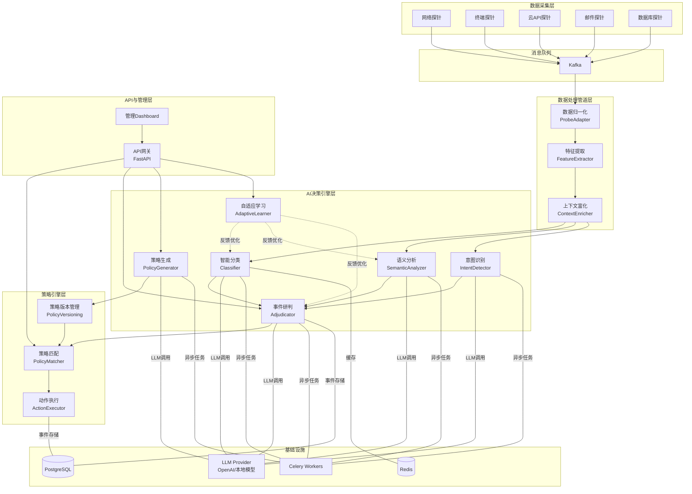

## 产品概述

构建一套AI大模型驱动的数据防泄漏(DLP)系统，利用LLM的语义理解和推理能力替代传统DLP中大量需要人工介入的环节（数据分类、语义分析、策略生成、事件研判、自适应学习），实现从"规则驱动+人工审核"到"AI驱动+人工审批"的范式转变。系统需对接已有的DLP数据采集探针。

## 核心功能

### 1. 探针数据对接与归一化

- 对接已有的网络探针、终端探针、云API探针、邮件探针、数据库探针
- 将不同探针上报的异构数据归一化为统一的事件格式
- 支持流式（Kafka）和批式两种数据接入模式

### 2. AI智能分类与语义分析

- LLM自动识别敏感数据类型（身份证、银行卡、商业机密、源代码等），无需人工维护正则规则库
- 理解数据传输的上下文语义，区分正常业务行为与数据泄漏行为
- 识别用户意图（如"发送合同给客户" vs "泄露合同给竞品"）

### 3. AI策略自动生成

- 根据合规要求（等保2.0、GDPR、行业法规）自动生成DLP策略
- 策略支持版本管理，人工仅需审批而非编写
- 策略匹配后执行对应动作：阻断、告警、脱敏、放行

### 4. AI事件研判

- 自动判断告警事件的严重程度和是否为误报
- 生成建议处置方案，减少90%以上的人工审核工作量
- 支持事件聚合、关联分析

### 5. 自适应学习闭环

- 根据历史人工处置结果持续反馈优化模型
- 自动调整分类阈值和策略参数
- 持续降低误报率和漏报率

### 6. 管理与可视化

- 提供REST API用于策略管理、事件查询、审计日志
- 探针注册与状态监控
- 模型效果监控（准确率、误报率等指标）

## 技术栈

- **语言**: Python 3.11+
- **Web框架**: FastAPI（高性能异步API）
- **AI/LLM**: OpenAI SDK + LangChain（LLM调用编排、Prompt管理、Chain组合）
- **消息队列**: Kafka（通过kafka-python对接探针数据流）
- **缓存**: Redis（策略缓存、限流、会话状态）
- **任务队列**: Celery（异步AI分析任务）
- **数据库**: PostgreSQL + SQLAlchemy（策略存储、事件存储、审计日志）
- **迁移工具**: Alembic
- **日志**: structlog（结构化日志）
- **监控**: prometheus-client（指标暴露）

## 实现方案

### 整体策略

采用分层微内核架构，将AI能力作为可插拔的"引擎模块"嵌入DLP数据处理管道中。核心数据流为：**探针上报 -> Kafka -> 数据归一化 -> AI引擎分析 -> 策略匹配 -> 动作执行 -> 事件存储**。LLM调用通过LangChain统一封装，支持多模型后端切换（OpenAI / 本地模型 / 混元等）。

### 关键技术决策

**1. LLM调用架构：异步+缓存+降级**

- AI分析为IO密集型操作，使用Celery异步任务处理，避免阻塞主数据管道
- 对相似内容的分类结果做Redis缓存（基于内容hash），减少重复LLM调用
- LLM不可用时降级为传统规则引擎，保证系统可用性
- 时间复杂度：单事件分析约1-3秒（LLM调用），通过并行+缓存将吞吐量提升至数百QPS

**2. Prompt工程化管理**

- 每个AI模块（分类/语义/研判/策略生成/意图识别）独立维护Prompt模板
- Prompt模板版本化存储，支持A/B测试
- 使用LangChain的PromptTemplate + OutputParser确保结构化输出

**3. 探针对接：统一事件模型**

- 定义统一的`DLPEvent`数据模型，所有探针数据归一化为此格式
- 通过Adapter模式为每种探针类型实现转换器
- 探针通过Kafka上报，系统消费消息后进入处理管道

**4. 策略引擎：规则+AI混合**

- 传统规则引擎处理确定性策略（如禁止外发特定文件类型）
- AI引擎处理需要语义理解的复杂策略（如商业机密识别）
- 两者结合，规则引擎做快速过滤，AI引擎做深度分析

**5. 自适应学习闭环**

- 存储每次AI研判结果和人工最终处置结果
- 定期批量提取反馈数据，用于Prompt优化和Few-shot示例更新
- 通过Prometheus指标监控模型准确率/误报率的变化趋势

## 实现注意事项

- **性能**: AI分析是主要瓶颈，必须通过Celery异步化 + Redis缓存（内容hash去重）+ 批量处理三重手段保障吞吐量；Kafka消费者应支持多worker并行消费
- **可靠性**: LLM调用设置超时(30s)和重试(最多3次)；LLM不可用时降级为规则引擎；所有事件持久化到数据库，确保不丢失
- **安全性**: 敏感数据在传入LLM前进行脱敏预处理（替换真实值为占位符），LLM分析完成后还原；API层做JWT认证和RBAC权限控制
- **日志**: 使用structlog结构化日志，AI分析结果记录置信度和决策依据；禁止日志中出现原始敏感数据；事件处理全链路添加trace_id

## 系统架构



## 目录结构

整体采用分层模块化结构，每层对应一个独立包，通过明确的接口约定解耦。AI引擎模块采用统一基类+子类实现的模式，便于扩展新的AI能力。

```
ai-dlp/
├── README.md                          # [NEW] 项目说明文档，包含架构概述、快速启动指南、部署说明
├── requirements.txt                   # [NEW] Python依赖清单，包含FastAPI/LangChain/Kafka/Redis/Celery/SQLAlchemy等核心依赖
├── architecture.py                    # [MODIFY] 保留原有架构描述，追加模块间接口约定说明
├── config/
│   ├── settings.py                    # [NEW] 全局配置管理，使用pydantic-settings从环境变量加载配置（LLM API Key、Kafka地址、Redis地址、数据库URL等），定义Settings单例
│   └── logging_config.py             # [NEW] structlog日志配置，定义日志格式、级别、处理器链，确保全链路trace_id传递
├── app/
│   ├── __init__.py                    # [NEW] 应用包初始化
│   ├── main.py                        # [NEW] FastAPI应用入口，注册所有路由、中间件（CORS/认证/限流/trace_id注入）、启动事件（初始化Kafka消费者、Celery连接）
│   ├── models/
│   │   ├── __init__.py                # [NEW] 数据模型包初始化
│   │   ├── event.py                   # [NEW] 核心数据模型：DLPEvent（统一事件格式，包含source/content/metadata/timestamp/trace_id）、EventSeverity枚举、ClassificationResult、AdjudicationResult等Pydantic模型
│   │   ├── policy.py                  # [NEW] 策略数据模型：Policy（策略定义，包含conditions/actions/priority/version）、PolicyAction枚举（BLOCK/ALERT/MASK/ALLOW）、PolicyVersion等
│   │   └── db_models.py              # [NEW] SQLAlchemy ORM模型：EventRecord、PolicyRecord、AuditLog、FeedbackRecord表定义，与PostgreSQL映射
│   ├── collection/
│   │   ├── __init__.py                # [NEW] 数据采集层包初始化
│   │   ├── consumer.py               # [NEW] Kafka消费者，订阅探针数据topic，反序列化消息后分发到数据处理管道；支持多worker并行消费、消费位移管理、错误重试
│   │   └── adapters/
│   │       ├── __init__.py            # [NEW] 适配器包初始化，导出adapter注册表
│   │       ├── base.py                # [NEW] ProbeAdapter抽象基类，定义normalize(raw_data) -> DLPEvent接口，所有探针适配器必须实现此接口
│   │       ├── network_adapter.py    # [NEW] 网络探针适配器，将网络流量数据（源IP/目标IP/协议/payload摘要）转换为DLPEvent
│   │       ├── endpoint_adapter.py   # [NEW] 终端探针适配器，将终端行为数据（文件操作/USB/打印/截屏）转换为DLPEvent
│   │       ├── email_adapter.py      # [NEW] 邮件探针适配器，将邮件数据（发件人/收件人/主题/正文摘要/附件信息）转换为DLPEvent
│   │       ├── cloud_api_adapter.py  # [NEW] 云API探针适配器，将云服务API调用数据转换为DLPEvent
│   │       └── database_adapter.py   # [NEW] 数据库探针适配器，将数据库访问审计数据（SQL/访问用户/表名/行数）转换为DLPEvent
│   ├── pipeline/
│   │   ├── __init__.py                # [NEW] 数据处理管道包初始化
│   │   ├── processor.py              # [NEW] 管道编排器DataPipeline，按顺序执行：归一化 -> 特征提取 -> 上下文富化 -> AI分析分发；支持管道步骤的灵活组合和跳过
│   │   ├── feature_extractor.py      # [NEW] 特征提取模块，从DLPEvent中提取关键特征（文件类型、数据量级、敏感关键词命中数、时间特征、行为频率等），输出特征向量附加到事件
│   │   └── context_enricher.py       # [NEW] 上下文富化模块，查询用户信息、设备信息、历史行为基线等补充上下文，为AI分析提供完整背景
│   ├── ai_engine/
│   │   ├── __init__.py                # [NEW] AI引擎包初始化
│   │   ├── base.py                    # [NEW] AI引擎模块抽象基类AIEngineBase，定义统一接口analyze(event) -> Result；封装LLM调用通用逻辑（重试/超时/降级/缓存检查/指标上报）
│   │   ├── llm_provider.py           # [NEW] LLM提供者封装，基于LangChain统一封装多模型后端（OpenAI/本地模型）；管理API Key轮转、调用频率控制、token用量统计
│   │   ├── classifier.py             # [NEW] 智能分类模块，使用LLM自动识别敏感数据类型（身份证/银行卡/手机号/商业机密/源代码/医疗记录等），输出分类标签+置信度；包含分类专用Prompt模板
│   │   ├── semantic_analyzer.py      # [NEW] 语义分析模块，使用LLM理解数据传输的业务上下文和语义含义，判断传输行为是否合理；包含语义分析专用Prompt模板
│   │   ├── intent_detector.py        # [NEW] 意图识别模块，使用LLM分析用户行为意图（正常办公/数据备份/疑似泄漏/恶意外发等），输出意图标签+置信度
│   │   ├── adjudicator.py            # [NEW] 事件研判模块，综合分类结果/语义分析/意图识别输出，进行最终风险评估；判断告警级别、是否误报、生成建议处置方案；是AI引擎的核心决策点
│   │   ├── policy_generator.py       # [NEW] 策略生成模块，根据合规要求（等保2.0/GDPR/自定义合规框架）使用LLM自动生成DLP策略规则；输出结构化策略JSON供人工审批
│   │   ├── adaptive_learner.py       # [NEW] 自适应学习模块，收集历史AI研判结果与人工最终处置的对比数据，分析误报/漏报模式，自动更新Few-shot示例库和分类阈值
│   │   └── prompts/
│   │       ├── __init__.py            # [NEW] Prompt模板包初始化
│   │       ├── classifier_prompts.py # [NEW] 数据分类Prompt模板集，包含系统提示词、Few-shot示例、输出格式约束；支持版本管理
│   │       ├── semantic_prompts.py   # [NEW] 语义分析Prompt模板集
│   │       ├── intent_prompts.py     # [NEW] 意图识别Prompt模板集
│   │       ├── adjudicator_prompts.py# [NEW] 事件研判Prompt模板集，包含多维度评估指引
│   │       └── policy_gen_prompts.py # [NEW] 策略生成Prompt模板集，包含不同合规框架的策略生成指引
│   ├── policy_engine/
│   │   ├── __init__.py                # [NEW] 策略引擎包初始化
│   │   ├── matcher.py                # [NEW] 策略匹配器PolicyMatcher，将AI分析结果与策略库中的条件进行匹配，返回命中的策略列表（按优先级排序）；支持规则引擎快速匹配+AI深度匹配两级过滤
│   │   ├── executor.py               # [NEW] 动作执行器ActionExecutor，根据匹配到的策略执行对应动作（阻断/告警/脱敏/放行/通知）；每种动作实现为独立的ActionHandler
│   │   └── version_manager.py        # [NEW] 策略版本管理，实现策略的创建/更新/回滚/审批流转；策略变更记录完整审计日志
│   ├── api/
│   │   ├── __init__.py                # [NEW] API路由包初始化
│   │   ├── deps.py                    # [NEW] API依赖注入，提供数据库session、当前用户、权限校验等公共依赖
│   │   ├── auth.py                    # [NEW] JWT认证与RBAC权限控制，实现token签发/验证、角色定义（admin/analyst/viewer）、接口权限装饰器
│   │   ├── routes_events.py          # [NEW] 事件相关API路由：查询事件列表/详情、事件统计、人工处置反馈提交、事件导出
│   │   ├── routes_policies.py        # [NEW] 策略相关API路由：策略CRUD、AI生成策略、策略审批、策略启用/禁用、版本回滚
│   │   ├── routes_probes.py          # [NEW] 探针管理API路由：探针注册/注销、状态心跳、探针列表查询
│   │   └── routes_dashboard.py       # [NEW] Dashboard数据API路由：全局统计指标、趋势图数据、模型准确率/误报率指标、数据地图概览
│   ├── storage/
│   │   ├── __init__.py                # [NEW] 存储层包初始化
│   │   ├── database.py               # [NEW] 数据库连接管理，创建SQLAlchemy异步引擎和session工厂；提供get_db依赖
│   │   ├── repository.py             # [NEW] 数据仓库层，封装EventRecord/PolicyRecord/AuditLog/FeedbackRecord的CRUD操作，提供分页/过滤/聚合查询
│   │   └── cache.py                  # [NEW] Redis缓存管理，封装AI分类结果缓存（基于内容hash的读写）、策略缓存、限流计数器
│   └── tasks/
│       ├── __init__.py                # [NEW] Celery任务包初始化，创建Celery应用实例
│       └── analysis_tasks.py         # [NEW] Celery异步任务定义：AI分类任务、语义分析任务、事件研判任务；支持任务优先级、超时控制、失败重试
├── alembic/
│   ├── env.py                         # [NEW] Alembic迁移环境配置，连接SQLAlchemy元数据
│   └── versions/                      # [NEW] 数据库迁移版本目录
│       └── 001_initial_schema.py     # [NEW] 初始数据库schema迁移脚本，创建events/policies/audit_logs/feedbacks表
├── tests/
│   ├── __init__.py                    # [NEW] 测试包初始化
│   ├── test_adapters.py              # [NEW] 探针适配器单元测试，验证各探针数据格式正确归一化为DLPEvent
│   ├── test_ai_engine.py            # [NEW] AI引擎模块单元测试，Mock LLM调用，验证分类/语义/研判输出格式和降级逻辑
│   └── test_policy_engine.py        # [NEW] 策略引擎单元测试，验证策略匹配逻辑和动作执行
├── docker-compose.yml                 # [NEW] 本地开发环境编排，包含PostgreSQL/Redis/Kafka/Zookeeper服务定义
├── Dockerfile                         # [NEW] 应用容器镜像构建文件
└── alembic.ini                        # [NEW] Alembic配置文件
```

## 关键代码结构

```python
# app/models/event.py - 统一事件模型（所有模块的数据契约）
from pydantic import BaseModel
from enum import Enum
from datetime import datetime
from typing import Optional

class ProbeType(str, Enum):
    NETWORK = "network"
    ENDPOINT = "endpoint"
    EMAIL = "email"
    CLOUD_API = "cloud_api"
    DATABASE = "database"

class EventSeverity(str, Enum):
    CRITICAL = "critical"
    HIGH = "high"
    MEDIUM = "medium"
    LOW = "low"
    INFO = "info"

class DLPEvent(BaseModel):
    """统一事件模型 - 所有探针数据归一化为此格式"""
    event_id: str
    trace_id: str
    probe_type: ProbeType
    timestamp: datetime
    source: str                    # 数据来源标识
    user_id: Optional[str]         # 操作用户
    content_summary: str           # 内容摘要(脱敏后)
    content_hash: str              # 内容哈希(用于缓存去重)
    metadata: dict                 # 探针特有元数据
    features: Optional[dict]       # 特征提取结果
    context: Optional[dict]        # 富化后的上下文

class ClassificationResult(BaseModel):
    labels: list[str]              # 敏感数据类型标签
    confidence: float              # 置信度 0-1
    reasoning: str                 # LLM推理依据

class AdjudicationResult(BaseModel):
    severity: EventSeverity
    is_false_positive: bool
    confidence: float
    risk_score: float              # 0-100
    recommended_action: str        # 建议处置方案
    reasoning: str
```

```python
# app/ai_engine/base.py - AI引擎模块统一基类
from abc import ABC, abstractmethod
from app.models.event import DLPEvent

class AIEngineBase(ABC):
    """AI引擎模块统一基类 - 所有AI模块继承此类"""
    
    @abstractmethod
    async def analyze(self, event: DLPEvent) -> dict:
        """分析事件，返回结构化结果"""
        ...

    async def analyze_with_fallback(self, event: DLPEvent) -> dict:
        """带降级的分析入口：LLM失败时降级为规则引擎"""
        ...

    def _check_cache(self, content_hash: str) -> dict | None:
        """检查Redis缓存是否有相同内容的分析结果"""
        ...

    def _save_cache(self, content_hash: str, result: dict) -> None:
        """缓存分析结果"""
        ...
```

```python
# app/collection/adapters/base.py - 探针适配器统一接口
from abc import ABC, abstractmethod
from app.models.event import DLPEvent

class ProbeAdapter(ABC):
    """探针适配器抽象基类 - 每种探针实现一个子类"""
    
    @abstractmethod
    def normalize(self, raw_data: dict) -> DLPEvent:
        """将探针原始数据转换为统一DLPEvent格式"""
        ...

    def sanitize_content(self, content: str) -> str:
        """敏感内容脱敏预处理（传入LLM前调用）"""
        ...
```

## Agent Extensions

### SubAgent

- **code-explorer**
- 用途：在实现过程中探索已有代码结构和模块间依赖关系，确保新增模块与已有architecture.py中的设计保持一致
- 预期结果：准确定位需要修改的文件位置和现有代码模式，避免重复或冲突

### Skill

- **skill-creator**
- 用途：在项目完成后创建AI-DLP系统开发技能文档，将项目的架构设计模式、Prompt工程方法论、探针对接规范等固化为可复用的技能
- 预期结果：生成一个描述AI-DLP开发最佳实践的skill，便于后续类似项目快速启动