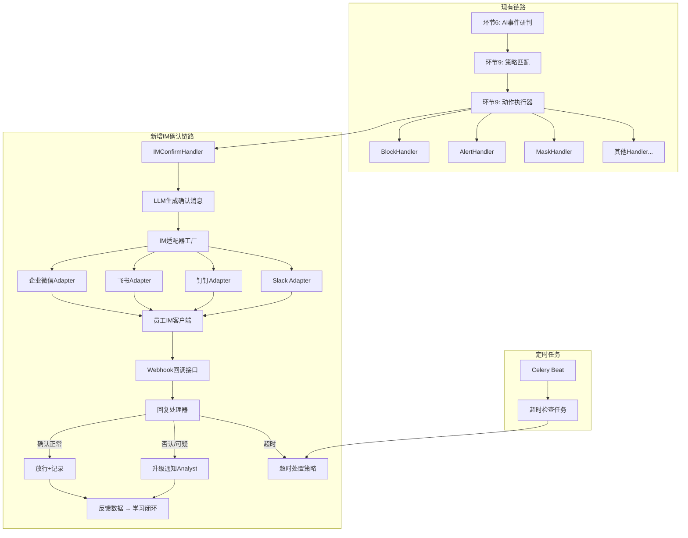
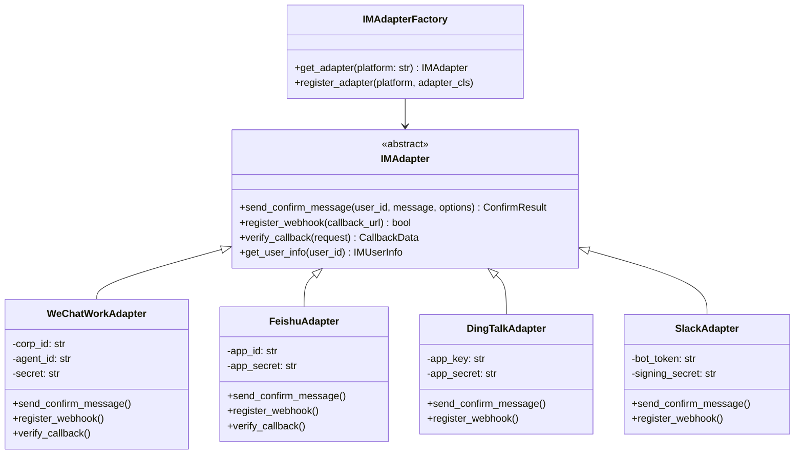
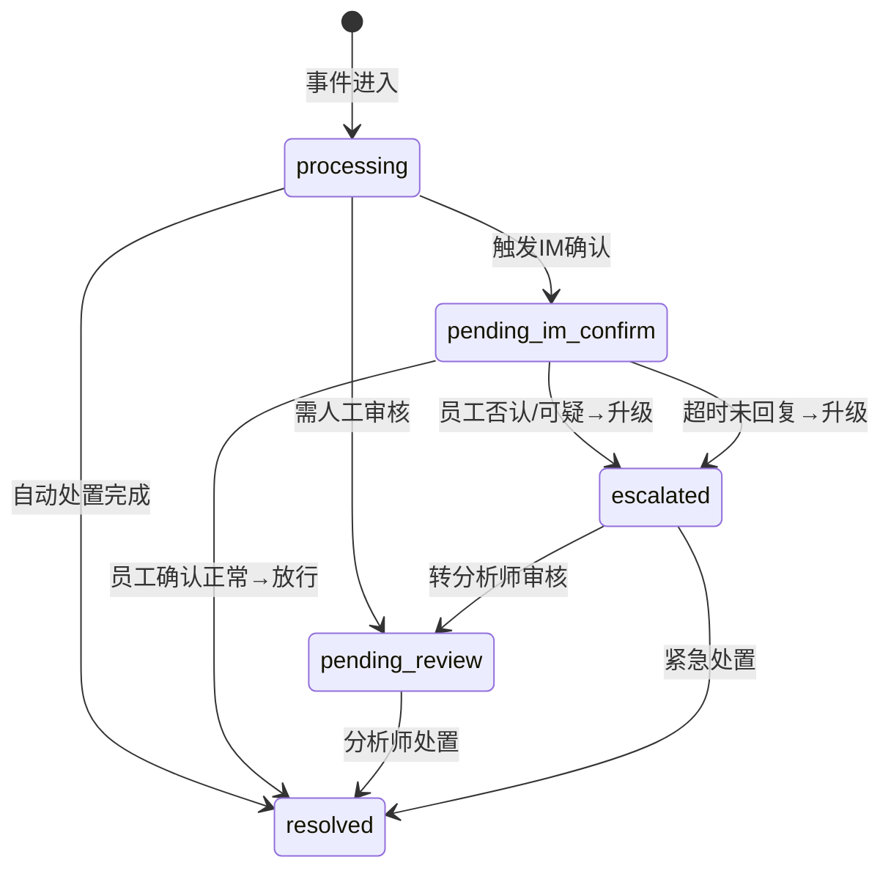

## 用户需求

在 AI-DLP 系统的设计文档（AI-DLP-Design.md）中新增企业 IM 集成能力模块，实现当系统发现风险事件时，通过企业 IM 工具（企业微信/飞书/钉钉/Slack）直接向涉事员工发送交互式确认消息，员工可在 IM 中回复确认或否认，系统根据回复结果自动完成后续处置，实现完整的风险闭环。

## 产品概述

当前 AI-DLP 系统的动作体系仅支持 7 种单向动作（block/alert/mask/allow/notify/quarantine/log），缺乏与涉事员工的双向交互确认能力。人机协同机制中的"人"仅指安全分析师，不包含涉事员工本人。本次需求在现有架构基础上，新增 `im_confirm` 动作类型及完整的企业 IM 集成章节，将涉事员工纳入风险处置闭环。

## 核心功能

1. **新增 `im_confirm` 动作类型**：在策略可用动作类型表（环节7）中增加 IM 交互确认动作，支持在策略中配置触发条件、超时时间、确认选项等参数
2. **IMConfirmHandler 动作处理器**：在策略引擎（环节9）中新增 IM 确认处理器，负责发起确认请求、管理异步回调、处理员工回复、执行后续处置
3. **企业 IM 适配器架构**：采用与探针 Adapter 类似的模式，支持企业微信、飞书、钉钉、Slack 等多平台接入，统一消息发送和回调接口
4. **LLM 驱动的确认消息生成**：使用 LLM 根据事件上下文生成通俗易懂的确认话术，对员工隐藏敏感技术细节，仅用概括性描述
5. **异步回调与状态机扩展**：新增 `pending_im_confirm` 事件状态，IM 平台通过 Webhook 回调更新事件状态；员工确认正常则放行并记录，否认或可疑则升级通知分析师
6. **超时与安全机制**：员工未回复的超时策略（可配置超时时间，默认升级处理）；防止冒名确认的身份验证；IM 消息不泄漏敏感数据
7. **回复结果纳入学习闭环**：员工确认结果作为反馈数据补充到自适应学习环节，持续优化 AI 研判准确率

## 技术栈

- 文档格式：Markdown，与现有 AI-DLP-Design.md 保持一致的文档风格
- 设计模式：遵循现有文档中的 Adapter 模式（探针适配器）、Handler 模式（动作执行器）、Prompt 工程模式
- 代码示例语言：Python（与现有文档中的伪代码保持一致，使用 async/await、type hints）

## 实现方案

### 整体策略

在现有 AI-DLP-Design.md 文档的多个位置进行增量修改，同时新增一个完整的第5章"企业IM集成与员工二次确认"。修改遵循现有文档的架构模式和编写风格，不引入新的设计范式。

### 关键技术决策

1. **IM 适配器采用与探针 Adapter 相同的设计模式**：现有文档环节1（第1行~）已有成熟的 Adapter 模式用于探针数据归一化，IM 适配器复用相同的抽象基类 + 具体实现的模式，降低学习成本和设计复杂度。

2. **确认消息生成引入 LLM（新增 Prompt）**：当前系统的 notify 动作仅支持静态消息模板。IM 确认消息需要根据事件上下文动态生成通俗表达（不能暴露分类标签、风险评分等内部概念给普通员工），这需要 LLM 的语义转换能力。将使用与其他 AI 模块相同的 Prompt 工程模式（System Prompt + User Prompt 模板 + Few-shot 示例）。

3. **事件状态机扩展而非新建独立状态机**：现有 EVENT 实体已有 `status` 字段，新增 `pending_im_confirm` 状态值即可，不引入独立的确认状态表，保持数据模型简洁。

4. **im_confirm 作为可组合的动作类型**：与现有 block/alert 等动作并列，可在策略 actions 数组中与其他动作组合使用（如 `im_confirm` + `log`），保持策略引擎的通用性。

5. **异步 Webhook 回调机制**：IM 确认是异步流程（员工可能几分钟甚至几小时后才回复），采用 Webhook 回调 + Redis 状态缓存 + 超时定时任务的方案，与现有 Celery Beat 定时任务架构一致。

### 性能与可靠性考量

- IM 确认为非实时路径（员工回复延迟可达分钟至小时级），不影响现有实时处理管道的性能目标（端到端P95 ≤10s）
- 确认消息生成的 LLM 调用预估 Token 消耗约 1,500/次（System ~500 + User ~600 + Output ~400），在现有 Token 预算框架内可控
- Webhook 回调需要幂等设计，防止 IM 平台重复推送导致状态异常
- 超时任务由 Celery Beat 调度，复用现有定时任务架构，无需新增基础设施

## 实现说明

### 文档修改策略

采用最小化侵入原则：在现有章节中做精准增量修改，主体内容集中在新增的第5章。具体修改点如下：

1. **目录区域（第9-31行）**：在第4章条目之后、附录之前插入第5章条目
2. **环节7策略生成 Prompt 的可用动作类型表（第1558-1568行）**：新增 `im_confirm` 行
3. **环节9动作执行器代码（第1922-1959行）**：新增 `IMConfirmHandler` 类，新增 ACTION_HANDLERS 注册，扩展 ACTION_SEVERITY 映射
4. **环节9冲突裁决 ACTION_SEVERITY（第1911行）**：新增 `im_confirm` 的严重等级评分
5. **模型选型总览表（第3.1节，第2061-2074行）**：新增 IM 确认消息生成行
6. **Token消耗估算表（第3.4节，第2098-2106行）**：新增 IM 确认消息生成的 Token 消耗行
7. **权限矩阵（第2028-2041行）**：新增 `im_confirm` 资源的权限定义
8. **API总览（PRD 第8节）**：新增 IM Webhook 回调 API 端点
9. **新增第5章**：完整的"企业IM集成与员工二次确认"章节，放在第4章之后、附录之前

### 第5章结构设计

```
5. 企业IM集成与员工二次确认
  5.1 功能概述与适用场景
  5.2 IM适配器架构（多平台统一接口）
  5.3 确认消息Prompt设计（System Prompt + User Prompt + Few-shot）
  5.4 IMConfirmHandler 处理流程
  5.5 异步回调与Webhook机制
  5.6 事件状态机扩展（pending_im_confirm）
  5.7 员工回复处理与后续处置
  5.8 超时策略
  5.9 回复结果纳入学习闭环
  5.10 安全机制
  5.11 系统配置项
  5.12 降级方案
```

### 防回归注意事项

- 保持现有7种动作类型的完整性不受影响，`im_confirm` 为纯增量新增
- 不修改现有 PolicyMatcher 匹配逻辑，仅扩展 ActionExecutor 的 handler 注册
- 确认流程的 `pending_im_confirm` 状态不应影响现有事件列表查询和统计逻辑（新增状态需要在事件中心 UI 中正确展示）
- IM 确认消息 Prompt 需通过 ResponseFilter 过滤敏感信息，复用现有脱敏机制

## 架构设计

### IM 集成在现有架构中的位置



### IM 适配器类结构



### 事件状态机扩展



## 目录结构

本次修改仅涉及一个文件的增量修改：

```
d:\workspace\ai-dlp\
└── AI-DLP-Design.md  # [MODIFY] 主设计文档，需在多个位置进行增量修改并新增第5章
```

详细修改清单：

```
AI-DLP-Design.md
├── 目录区域 (第9-31行)                          # [MODIFY] 新增第5章及其子节目录条目
├── 2.7 环节7 可用动作类型表 (第1558-1568行)      # [MODIFY] 新增 im_confirm 动作类型行
├── 2.9 环节9 ACTION_SEVERITY (第1911行)         # [MODIFY] 新增 im_confirm 严重等级
├── 2.9 环节9 动作执行器 (第1922-1959行)          # [MODIFY] 新增 IMConfirmHandler 类和注册
├── 2.10 权限矩阵 (第1976-1993行)                # [MODIFY] 新增 IM确认 功能行
├── 2.10 API RBAC (第2028-2041行)                # [MODIFY] 新增 im_confirm 权限条目
├── 3.1 模型选型总览表 (第2061-2074行)            # [MODIFY] 新增 IM 确认消息生成模型行
├── 3.4 Token消耗估算表 (第2098-2106行)           # [MODIFY] 新增 IM 确认消息 Token 行
├── 第4章与附录之间 (第3013行之后)                 # [NEW] 插入完整第5章：企业IM集成与员工二次确认
│   ├── 5.1 功能概述与适用场景
│   ├── 5.2 IM适配器架构
│   ├── 5.3 确认消息Prompt设计（含System/User Prompt + Few-shot）
│   ├── 5.4 IMConfirmHandler处理流程
│   ├── 5.5 异步回调与Webhook机制
│   ├── 5.6 事件状态机扩展
│   ├── 5.7 员工回复处理与后续处置
│   ├── 5.8 超时策略
│   ├── 5.9 回复结果纳入学习闭环
│   ├── 5.10 安全机制
│   ├── 5.11 系统配置项
│   └── 5.12 降级方案
└── 附录 (原第3016行起)                           # [MODIFY] 附录标题编号可能需更新为与新结构一致
```

## 关键代码结构

以下为新增第5章中的核心接口定义（伪代码，与现有文档风格一致）：

```python
# IM 适配器抽象基类
class IMAdapter(ABC):
    """企业IM平台适配器统一接口（类比探针Adapter模式）"""
    
    @abstractmethod
    async def send_confirm_message(
        self, user_id: str, message: ConfirmMessage, options: list[ConfirmOption]
    ) -> SendResult: ...
    
    @abstractmethod
    async def verify_callback(self, request: WebhookRequest) -> CallbackData: ...

# im_confirm 动作参数结构
IMConfirmActionParams = {
    "timeout_minutes": int,          # 超时时间，默认30
    "confirm_options": list[str],    # 确认选项，如 ["confirm_normal", "deny", "need_help"]
    "on_confirm": str,               # 确认后动作：allow / log
    "on_deny": str,                  # 否认后动作：escalate / block
    "on_timeout": str,               # 超时后动作：escalate / block
    "im_platform": str,              # 目标IM平台：wechat_work / feishu / dingtalk / slack
}
```

## Agent Extensions

### SubAgent

- **code-explorer**
- 用途：在编写第5章内容前，深入探索 AI-DLP-Design.md 中探针适配器（环节1）的完整代码模式，确保 IM 适配器设计与之完全一致；同时探索环节8自适应学习的反馈数据结构，确保 IM 回复数据能正确接入学习闭环
- 预期结果：获取探针 Adapter 基类的完整接口定义和反馈数据写入路径，作为 IM 适配器和学习闭环集成的设计参考