# AI-DLP 智能数据防泄漏系统 — 产品需求文档 (PRD)

> **文档版本**：v1.0  
> **创建日期**：2026-02-15  
> **文档状态**：初稿  

---

## 目录

- [1. 产品背景与目标](#1-产品背景与目标)
- [2. 用户角色定义](#2-用户角色定义)
- [3. 系统架构总览](#3-系统架构总览)
- [4. 核心功能模块详细设计](#4-核心功能模块详细设计)
  - [4.1 探针数据对接与归一化](#41-探针数据对接与归一化)
  - [4.2 数据处理管道](#42-数据处理管道)
  - [4.3 AI智能数据分类](#43-ai智能数据分类)
  - [4.4 AI语义分析](#44-ai语义分析)
  - [4.5 AI意图识别](#45-ai意图识别)
  - [4.6 AI事件智能研判](#46-ai事件智能研判)
  - [4.7 AI策略自动生成](#47-ai策略自动生成)
  - [4.8 自适应学习闭环](#48-自适应学习闭环)
  - [4.9 策略兜底校验与动作执行](#49-策略兜底校验与动作执行)
  - [4.10 管理与可视化平台](#410-管理与可视化平台)
- [5. 非功能需求](#5-非功能需求)
- [6. 数据架构设计](#6-数据架构设计)
- [7. 部署架构](#7-部署架构)
- [8. API网关设计](#8-api网关设计)
- [9. 附录](#9-附录)

---

## 1. 产品背景与目标

### 1.1 行业痛点

传统数据防泄漏（DLP）系统在实际运营中面临以下核心痛点：

| 痛点 | 具体表现 | 影响 |
|------|---------|------|
| **规则僵化** | 依赖正则表达式和关键词匹配，无法理解语义 | 面对新型数据泄漏场景失效，需持续人工补充规则 |
| **误报率高** | 规则过于宽泛导致大量误报，过于精确则遗漏真实威胁 | 安全团队80%+时间消耗在处理误报上 |
| **策略维护成本高** | 数据分类规则、检测策略、响应规则均需人工编写和更新 | 策略更新滞后于业务变化，平均策略更新周期2-4周 |
| **人工审核瓶颈** | 每条告警均需安全分析师人工研判 | 日均数千条告警，严重依赖人力，高价值告警易被淹没 |
| **缺乏自学习能力** | 系统无法从历史处置结果中学习 | 相同类型的误报反复出现，处理效率无法提升 |

### 1.2 产品定位

**AI-DLP** 是一套以AI大模型为核心决策引擎的新一代数据防泄漏系统。系统对接已有的DLP数据采集探针，通过LLM的语义理解和推理能力，在数据分类、语义分析、策略生成、事件研判、自适应学习五个关键环节替代人工介入，实现从**"规则驱动 + 人工审核"**到**"AI驱动 + 人工审批"**的范式转变。

### 1.3 产品目标

| 目标维度 | 具体指标 | 时间线 |
|---------|---------|-------|
| **降低误报率** | 系统整体误报率从行业平均60%+降至15%以下 | 上线后3个月 |
| **减少人工审核** | 人工审核工作量减少90%以上 | 上线后1个月 |
| **策略自动化** | 80%以上的DLP策略由AI自动生成，人工仅需审批 | 上线后2个月 |
| **缩短响应时间** | 事件研判从平均4小时缩短至秒级自动研判 | 上线即实现 |
| **持续优化** | 模型准确率逐月提升，6个月后达到95%+ | 上线后6个月 |

### 1.4 核心价值主张

```
传统DLP：探针采集 → 规则匹配 → 人工审核 → 人工处置 → 人工优化规则
AI-DLP ：探针采集 → AI语义理解 → AI智能研判 → 自动/半自动处置 → AI自适应学习
```

- **5个AI替代人工介入点**：数据分类、语义分析、策略生成、事件研判、自适应学习
- **2种运行模式**：全自动模式（AI决策+自动执行）、人机协同模式（AI建议+人工审批）
- **1个闭环**：处置反馈驱动的持续学习闭环

### 1.5 前置条件与约束

| 条件 | 说明 |
|------|------|
| 已有DLP探针 | 系统不重新开发探针，对接已有的网络/终端/云API/邮件/数据库探针 |
| LLM依赖 | 核心AI能力依赖大语言模型API（支持OpenAI/本地部署/混元等多模型后端） |
| 数据合规 | 敏感数据传入LLM前必须脱敏预处理，符合数据安全法规要求 |
| 渐进上线 | 系统初期以"AI建议+人工审批"模式运行，验证稳定后逐步切换为全自动模式 |

---

## 2. 用户角色定义

### 2.1 角色矩阵

| 角色 | 职责 | 核心使用场景 | 系统权限级别 |
|------|------|-------------|-------------|
| **安全管理员 (Admin)** | 系统配置、策略审批、模型管理 | 审批AI生成的策略、配置系统参数、管理用户权限 | 最高权限 |
| **安全分析师 (Analyst)** | 事件研判、处置执行、反馈提交 | 审核AI研判结果、执行处置方案、对AI判断提供反馈 | 操作权限 |
| **合规官 (Compliance Officer)** | 合规审计、报告生成 | 查看合规报告、审计日志、数据地图 | 只读+导出权限 |
| **系统运维 (Operator)** | 探针管理、系统监控 | 管理探针状态、监控系统健康度、查看性能指标 | 运维权限 |
| **查看者 (Viewer)** | 查看Dashboard | 查看统计概览、趋势报表 | 只读权限 |

### 2.2 角色权限详细映射

```
┌──────────────┬─────────┬─────────┬────────────┬──────────┬─────────┐
│ 功能模块      │ Admin   │ Analyst │ Compliance │ Operator │ Viewer  │
├──────────────┼─────────┼─────────┼────────────┼──────────┼─────────┤
│ 策略管理      │ 全部     │ 查看     │ 查看        │ -        │ -       │
│ 策略审批      │ 审批     │ -       │ -           │ -        │ -       │
│ 事件查看      │ 全部     │ 全部     │ 全部        │ 查看      │ 查看    │
│ 事件处置      │ 全部     │ 处置+反馈│ -           │ -        │ -       │
│ AI模型管理    │ 全部     │ -       │ -           │ -        │ -       │
│ 探针管理      │ 全部     │ 查看     │ -           │ 全部      │ -       │
│ 审计日志      │ 全部     │ 查看     │ 全部+导出    │ 查看      │ -       │
│ Dashboard    │ 全部     │ 全部     │ 全部        │ 全部      │ 查看    │
│ 系统配置      │ 全部     │ -       │ -           │ 部分      │ -       │
│ 用户管理      │ 全部     │ -       │ -           │ -        │ -       │
└──────────────┴─────────┴─────────┴────────────┴──────────┴─────────┘
```

### 2.3 核心用户旅程

**安全分析师的一天（对比传统DLP vs AI-DLP）：**

| 时间段 | 传统DLP | AI-DLP |
|-------|---------|--------|
| 9:00 | 打开系统，面对2000+条待审核告警 | 打开系统，AI已自动研判95%事件，仅50条需人工确认 |
| 9:30 | 逐条查看告警，判断是否误报 | 查看AI标记为"高风险"的事件，AI已给出研判理由和建议 |
| 11:00 | 处理了50条告警，其中40条是误报 | 确认/修正AI研判结果，系统自动执行处置 |
| 14:00 | 继续处理告警积压 | 查看Dashboard，关注模型准确率趋势 |
| 15:00 | 发现新型泄漏模式，需请求策略团队新增规则 | AI已识别新模式并自动生成策略草稿，提交审批 |
| 17:00 | 当日处理200条，积压仍有1800条 | 全部事件处理完毕，反馈数据已自动进入学习闭环 |

---

## 3. 系统架构总览

### 3.1 分层架构

系统采用6层分层架构，自下而上依次为：

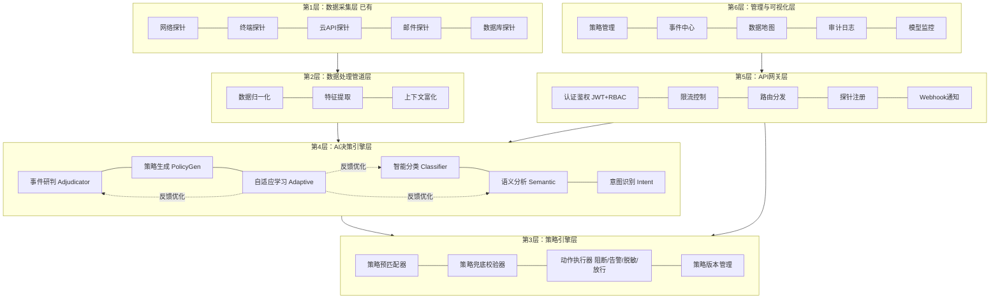

### 3.2 核心数据流

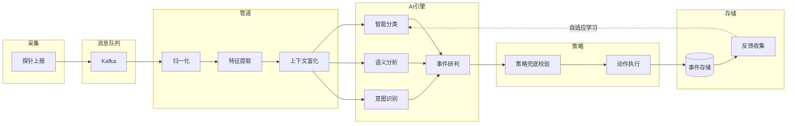

### 3.3 AI介入全景图

| 环节 | 传统方式（人工介入） | AI-DLP方式（AI介入） | AI模型能力要求 |
|------|-------------------|---------------------|---------------|
| 数据分类 | 人工维护正则规则库（500+条规则） | LLM自动识别敏感数据类型 | 文本分类、实体识别 |
| 语义分析 | 人工判断数据传输是否合理 | LLM理解业务上下文语义 | 语义理解、上下文推理 |
| 意图识别 | 安全分析师人工推断用户意图 | LLM分析行为序列判断意图 | 行为序列理解、意图推理 |
| 策略生成 | 安全团队手工编写策略规则 | LLM根据合规框架自动生成 | 合规知识、规则生成 |
| 事件研判 | 分析师逐条审核告警 | LLM综合多维信息自动研判 | 多因素综合推理、风险评估 |
| 自适应学习 | 定期人工复盘优化规则 | 自动收集反馈优化模型 | 模式识别、参数调优 |

---

## 4. 核心功能模块详细设计

### 4.1 探针数据对接与归一化

#### 4.1.1 功能概述

将已有的5类DLP探针上报的异构数据，通过统一的适配器转换为标准化的 `DLPEvent` 事件格式，屏蔽不同探针间的数据差异，为下游AI分析管道提供统一输入。

#### 4.1.2 已有探针类型与数据特征

| 探针类型 | 数据来源 | 典型数据内容 | 上报频率 |
|---------|---------|-------------|---------|
| **网络探针** | 网络流量镜像/代理 | 源/目标IP、协议、端口、payload摘要、URL、请求方法 | 高频（万级/秒） |
| **终端探针** | 终端Agent | 文件操作（复制/移动/删除）、USB接入、打印、截屏、剪贴板 | 中频（百级/秒） |
| **云API探针** | 云服务API网关 | API调用（对象存储上传/下载、云盘分享）、调用者身份、目标资源 | 中频（百级/秒） |
| **邮件探针** | 邮件网关 | 发件人、收件人、主题、正文摘要、附件信息（类型/大小/hash） | 低频（十级/秒） |
| **数据库探针** | 数据库审计 | SQL语句、执行用户、目标库表、返回行数、执行耗时 | 中频（百级/秒） |

#### 4.1.3 统一事件模型 (DLPEvent)

| 字段 | 类型 | 必填 | 说明 |
|------|------|------|------|
| `event_id` | string (UUID) | 是 | 全局唯一事件标识 |
| `trace_id` | string (UUID) | 是 | 全链路追踪标识 |
| `probe_type` | enum | 是 | 探针类型：network/endpoint/email/cloud_api/database |
| `timestamp` | datetime | 是 | 事件发生时间（探针端时间戳） |
| `ingest_time` | datetime | 是 | 系统接收时间 |
| `source` | string | 是 | 数据来源标识（探针实例ID） |
| `user_id` | string | 否 | 操作用户标识 |
| `user_name` | string | 否 | 操作用户名称 |
| `user_department` | string | 否 | 用户所属部门 |
| `action` | string | 是 | 用户行为动作（如file_copy、email_send、sql_query） |
| `target` | string | 是 | 操作目标（文件路径/收件人/URL/表名等） |
| `content_summary` | string | 是 | 内容摘要（脱敏后，最大2000字符） |
| `content_hash` | string | 是 | 内容SHA256哈希（用于缓存去重） |
| `content_size` | integer | 否 | 内容大小（字节） |
| `metadata` | object | 是 | 探针特有扩展元数据 |
| `features` | object | 否 | 特征提取结果（管道第2步填充） |
| `context` | object | 否 | 上下文富化结果（管道第3步填充） |
| `raw_data_ref` | string | 否 | 原始数据存储引用（用于溯源） |

#### 4.1.4 各探针元数据扩展定义

**网络探针 metadata**：src_ip、dst_ip、src_port、dst_port、protocol、http_method、url、domain、direction（inbound/outbound）、is_encrypted

**终端探针 metadata**：device_id、device_name、os_type、file_path、file_type、file_size、operation（copy/move/delete/print/screenshot/clipboard）、destination、process_name

**邮件探针 metadata**：from_address、to_addresses、cc_addresses、subject、has_attachment、attachment_count、attachment_types、attachment_total_size、is_external

**云API探针 metadata**：cloud_provider、service_name、api_action（upload/download/share/delete）、resource_id、resource_name、share_scope（private/internal/public）、access_key_id

**数据库探针 metadata**：db_type、db_instance、db_name、table_names、sql_type（SELECT/INSERT/UPDATE/DELETE/EXPORT）、sql_summary、affected_rows、execution_time_ms、is_bulk_operation

#### 4.1.5 数据接入模式

**模式一：流式接入（主要模式）**

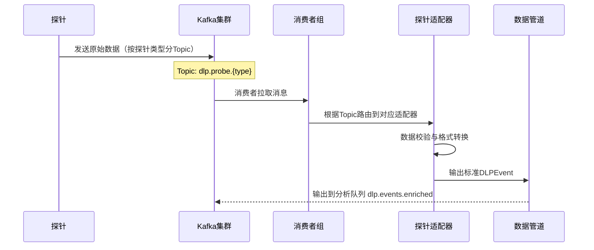

- **Kafka Topic规划**：每类探针独立Topic（`dlp.probe.network`、`dlp.probe.endpoint`等）
- **消费者组**：支持多worker并行消费，水平扩展吞吐量
- **消费保证**：at-least-once语义，配合事件去重（基于event_id）

**模式二：批式接入（补充模式）**——用于历史数据导入、离线日志分析，通过API批量上传。

#### 4.1.6 异常处理

| 异常场景 | 处理策略 |
|---------|---------|
| 探针数据格式异常 | 记录错误日志，将原始数据存入死信队列（DLQ），不阻塞主流程 |
| 必填字段缺失 | 适配器尝试从上下文推断填充，无法推断则标记为incomplete事件 |
| Kafka消费延迟 | 自动扩展消费者worker数量，触发延迟告警 |
| 探针长时间无数据 | 心跳检测机制，超过5分钟标记探针为离线并告警 |
| 数据量突增 | 基于Kafka背压机制自动调节消费速率 |

---

### 4.2 数据处理管道

#### 4.2.1 功能概述

对归一化后的 `DLPEvent` 进行特征提取和上下文富化，为下游AI引擎提供高质量的分析输入。

#### 4.2.2 管道处理流程

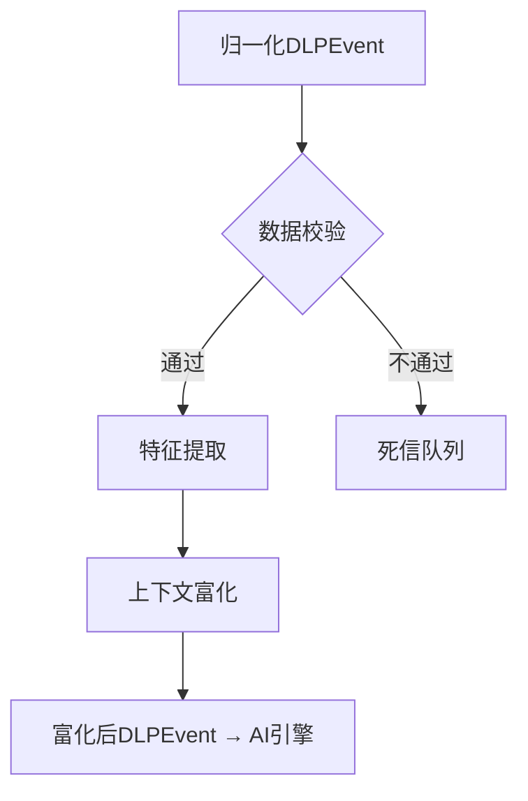

#### 4.2.3 特征提取规格

| 特征类别 | 提取内容 | 用途 |
|---------|---------|------|
| **文本特征** | 关键词命中数、正则预筛结果、文本长度、语言检测 | 为AI分类提供初步信号 |
| **行为特征** | 操作频率（近1h/24h/7d同类操作次数）、是否非工作时间、数据量是否超基线 | 为意图识别提供行为偏离度 |
| **结构特征** | 文件类型、MIME类型、扩展名与内容是否一致、是否压缩/加密 | 检测文件伪装和加密外传 |
| **统计特征** | 内容信息熵、编码方式检测（Base64/Hex等）、重复率 | 检测编码隐藏和数据混淆 |

#### 4.2.4 上下文富化规格

| 富化维度 | 数据来源 | 富化内容 |
|---------|---------|---------|
| **用户画像** | 用户目录/HR系统 | 部门、职级、角色、入职时长、历史违规次数、行为基线 |
| **资产信息** | 数据资产管理系统 | 数据分级（公开/内部/机密/绝密）、数据归属部门、已有敏感标签 |
| **环境信息** | 系统上下文 | 是否工作时间、是否工作网络、设备是否公司资产 |
| **关联事件** | 事件数据库 | 同用户最近24h事件概要、同目标资产近期事件 |

#### 4.2.5 管道配置能力

- **步骤开关**：可独立启用/禁用任一子步骤
- **超时控制**：特征提取≤500ms、上下文富化≤1s
- **跳过条件**：基于事件属性的跳过规则（如纯内部事件跳过部分富化）
- **优先级队列**：高优先级事件（如大数据量外发）优先处理

---

### 4.3 AI智能数据分类

#### 4.3.1 功能概述

使用大语言模型自动识别事件中涉及的敏感数据类型，替代传统DLP中人工维护的正则规则库。系统能理解数据的语义含义而非仅匹配格式模式，大幅提升分类准确率和覆盖面。

#### 4.3.2 敏感数据分类体系（三级分类）

```
├── 个人身份信息 (PII)
│   ├── 身份证号码 / 护照号码 / 手机号码 / 电子邮箱 / 家庭住址 / 生物特征信息
├── 金融信息
│   ├── 银行卡号 / 信用卡号(含CVV) / 银行账户 / 交易记录 / 薪资信息 / 财务报表
├── 商业机密
│   ├── 产品设计文档 / 商业计划书 / 客户名单 / 定价策略 / 供应商合同 / 并购文件
├── 技术资产
│   ├── 源代码 / API密钥凭证 / 数据库连接信息 / 系统架构文档 / 算法模型文件
├── 医疗健康信息
│   ├── 病历记录 / 检查报告 / 处方信息 / 健康档案
├── 法律与合规
│   ├── 法律意见书 / 诉讼文件 / 合规审计报告 / 监管函件
└── 其他敏感信息
    ├── 内部通信记录 / 涉密会议纪要 / 未分类敏感内容
```

#### 4.3.3 分类业务流程

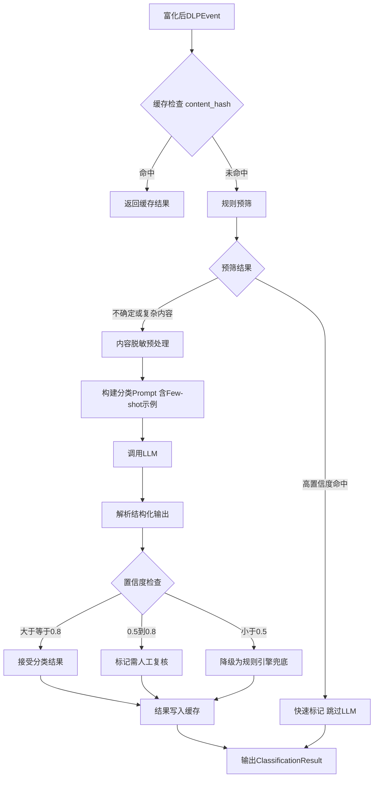

#### 4.3.4 AI介入方式

**Prompt设计策略：**
- **System Prompt**：定义分类专家角色，明确分类体系和输出格式要求
- **Few-shot示例**：每个分类提供2-3个典型样本，随自适应学习动态更新
- **输出格式约束**：要求LLM输出JSON结构

**LLM输入（脱敏后）**：事件内容摘要 + 文本特征 + 元数据上下文

**LLM输出（ClassificationResult）：**

| 字段 | 类型 | 说明 |
|------|------|------|
| `labels` | list[string] | 敏感数据类型标签列表（支持多标签） |
| `primary_label` | string | 主分类标签 |
| `confidence` | float (0-1) | 整体置信度 |
| `label_details` | list[object] | 每个标签的独立置信度和证据 |
| `reasoning` | string | 分类推理过程说明 |

#### 4.3.5 降级与性能

| 降级条件 | 降级策略 |
|---------|---------|
| LLM调用超时（>30s） | 使用规则引擎（正则+关键词）进行基础分类 |
| LLM服务不可用 | 切换备用LLM模型；均不可用则降级为规则引擎 |
| 置信度过低（<0.5） | 规则引擎结果兜底，标记为"待人工分类" |
| Token预算超限 | 截取内容摘要重试，或降级为轻量级模型 |

| 性能指标 | 目标 |
|---------|------|
| 单事件分类延迟（缓存命中） | <10ms |
| 单事件分类延迟（LLM调用） | <3s |
| 缓存命中率 | >60% |
| 分类准确率 | >90%（上线3个月后） |
| 吞吐量 | 500+ events/s |

---

### 4.4 AI语义分析

#### 4.4.1 功能概述

使用大语言模型理解数据传输行为的业务上下文和语义含义，判断数据流转是否合理。传统DLP仅检测"是否包含敏感数据"，AI语义分析进一步回答"这次传输是否合理、是否存在泄漏风险"。

#### 4.4.2 语义分析五维度

| 分析维度 | 具体内容 | 示例 |
|---------|---------|------|
| **业务合理性** | 数据传输是否符合业务场景 | 财务人员发送财报给审计→合理；研发人员外发财报→异常 |
| **接收方合理性** | 数据接收方是否合理 | 发送合同给客户→合理；发送合同给竞品→异常 |
| **渠道合理性** | 传输渠道是否合理 | 邮件发送工作文件→合理；网盘公开分享→异常 |
| **内容匹配度** | 传输内容与声明/标题是否一致 | 邮件主题"会议纪要"但附件是客户数据库→异常 |
| **时间合理性** | 操作时间是否合理 | 凌晨3点批量下载客户数据→异常 |

#### 4.4.3 分析业务流程

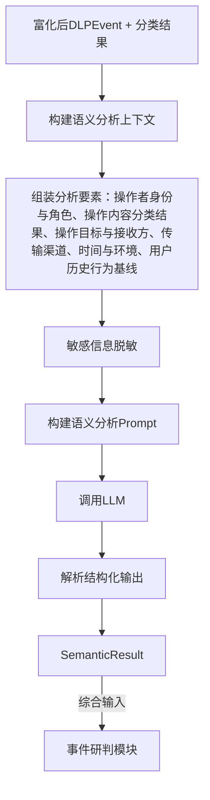

#### 4.4.4 LLM输出（SemanticResult）

| 字段 | 类型 | 说明 |
|------|------|------|
| `is_normal_business` | boolean | 是否为正常业务行为 |
| `risk_level` | enum | 风险等级：none/low/medium/high/critical |
| `dimension_scores` | object | 5个维度各自评分（0-1）和判断理由 |
| `anomaly_indicators` | list[string] | 检测到的异常指标列表 |
| `business_scenario` | string | 推断的业务场景描述 |
| `reasoning` | string | 完整推理过程 |

#### 4.4.5 降级方案

| 降级条件 | 降级策略 |
|---------|---------|
| LLM不可用 | 退化为基于规则的行为异常检测 |
| 上下文信息不完整 | 仅基于已有信息部分维度分析，缺失维度标记为"unknown" |
| 处理延迟过高 | 先放行并标记为"待深度分析"，异步补充分析结果 |

#### 4.4.6 典型场景对比

| 场景 | 传统DLP判断 | AI语义分析判断 |
|------|-----------|---------------|
| 财务经理发送季报给外部审计师 | 告警：外发财务数据 | 正常：符合审计业务流程 |
| 研发工程师将源码上传到个人GitHub | 可能漏报 | 高风险：源码外传至个人账号 |
| 销售在客户现场分享产品介绍 | 告警：外发产品文档 | 正常：内容为公开产品介绍 |
| 离职员工凌晨批量下载客户名单 | 告警：大量数据查询 | 极高风险：离职+非工作时间+批量+敏感数据 |

---

### 4.5 AI意图识别

#### 4.5.1 功能概述

使用大语言模型分析用户行为序列和上下文，推断用户操作意图。从"行为是否异常"进阶到"用户的目的是什么"，为事件研判提供关键决策因子。

#### 4.5.2 意图分类体系

| 意图类别 | 说明 | 风险等级 |
|---------|------|---------|
| **正常办公** | 日常工作中的数据使用和传输 | 无风险 |
| **合规流转** | 按审批流程的数据流转 | 无风险 |
| **数据备份** | 个人或团队的数据备份行为 | 低风险 |
| **知识分享** | 内部知识分享和文档协作 | 低风险 |
| **数据整理** | 数据汇总、清洗、迁移 | 中风险 |
| **疑似无意泄漏** | 操作者可能不知情的泄漏 | 中高风险 |
| **疑似有意泄漏** | 存在蓄意泄漏数据的迹象 | 高风险 |
| **恶意外发** | 明确的恶意数据外泄 | 极高风险 |
| **无法判断** | 信息不足以判断意图 | 需人工研判 |

#### 4.5.3 核心分析逻辑

LLM通过以下信息链推断意图：
1. **行为序列模式**：单次操作 vs 短时间大量操作、是否有规律性
2. **角色-行为匹配**：操作是否在用户职责范围内
3. **时间异常检测**：是否在非常规时间操作
4. **目标异常检测**：数据流向是否异常（内部→外部、工作→个人）
5. **前后文关联**：操作前后是否有"清理痕迹"等关联行为

**LLM输出（IntentResult）：**

| 字段 | 类型 | 说明 |
|------|------|------|
| `primary_intent` | string | 主要意图标签 |
| `confidence` | float (0-1) | 置信度 |
| `intent_chain` | list[string] | 意图推理链 |
| `risk_indicators` | list[string] | 支持该意图判断的风险指标 |
| `counter_indicators` | list[string] | 与该意图判断相矛盾的指标 |
| `reasoning` | string | 详细推理过程 |

#### 4.5.4 降级方案

| 降级条件 | 降级策略 |
|---------|---------|
| LLM不可用 | 基于规则的简单意图推断（角色匹配+时间+频率） |
| 行为序列数据不足 | 仅基于单事件分析，意图置信度标记为"低" |
| 用户画像缺失 | 跳过角色匹配，仅基于行为模式分析 |

---

### 4.6 AI事件智能研判

#### 4.6.1 功能概述

事件研判是AI决策引擎的**核心决策点**。综合分类、语义分析、意图识别三个上游模块输出，进行最终风险评估和处置建议生成，替代安全分析师"逐条审核告警"的工作。

#### 4.6.2 研判输入要素

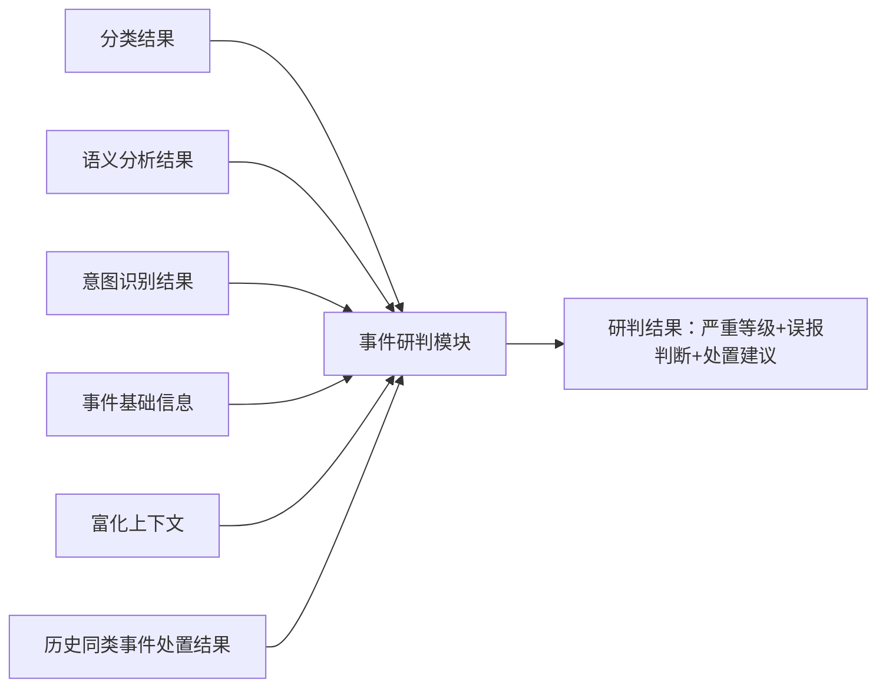

#### 4.6.3 研判业务流程

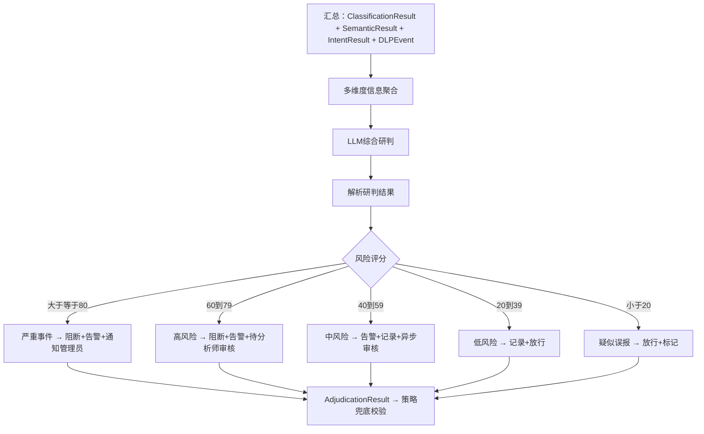

#### 4.6.4 多因子加权评分模型

| 评分因子 | 权重 | 评分范围 | 说明 |
|---------|------|---------|------|
| 数据敏感度 | 22% | 0-100 | 基于分类结果，绝密=100，机密=80，内部=40，公开=10 |
| 分类置信度 | 8% | 0-100 | AI分类置信度转百分制 |
| 行为异常度 | 18% | 0-100 | 基于语义分析5维度综合分数 |
| 意图风险度 | 18% | 0-100 | 基于意图识别风险等级 |
| 用户风险度 | 9% | 0-100 | 离职中=高，历史违规=高，新员工=中 |
| 数据量级 | 7% | 0-100 | 传输数据量相对基线偏离度 |
| 环境风险度 | 7% | 0-100 | 时间/网络/设备异常度 |
| 策略命中度 | 11% | 0-100 | 预匹配策略的最高优先级（≥90→100，≥70→80，其他→50，无→0） |

> 以上为初始权重（8因子含策略命中度），LLM在实际研判中动态调整，权重参数通过自适应学习持续优化。

#### 4.6.5 LLM输出（AdjudicationResult）

| 字段 | 类型 | 说明 |
|------|------|------|
| `severity` | enum | 严重等级：critical/high/medium/low/info |
| `risk_score` | float (0-100) | 综合风险评分 |
| `is_false_positive` | boolean | 是否判断为误报 |
| `false_positive_reason` | string | 误报原因 |
| `recommended_actions` | list[string] | 建议处置动作列表 |
| `policy_enforced_actions` | list[string] | 策略强制要求的动作列表 |
| `matched_policy_ids` | list[string] | 命中的策略ID列表 |
| `requires_human_review` | boolean | 是否需要人工复核 |
| `human_review_reason` | string | 需人工复核的原因 |
| `evidence_summary` | list[string] | 关键证据摘要 |
| `similar_cases` | list[object] | 历史相似案例 |
| `reasoning` | string | 完整推理过程 |
| `confidence` | float (0-1) | 研判置信度 |

#### 4.6.6 事件聚合与关联分析

| 聚合维度 | 聚合规则 | 告警升级条件 |
|---------|---------|-------------|
| **同用户聚合** | 同一用户24h内多次事件 | 低风险事件≥5次 → 升级为中风险 |
| **同目标聚合** | 同一数据资产被多人操作 | 3人以上1h内访问同一机密文件 → 高风险 |
| **同行为聚合** | 相同操作模式跨多用户 | 多人短时间内相同异常操作 → 可能协同泄漏 |
| **时间窗口聚合** | 时间窗口内事件模式分析 | 非工作时间事件密度异常 → 升级风险等级 |

#### 4.6.7 人机协同机制

| 研判置信度 | 系统行为 | 人工介入方式 |
|-----------|---------|-------------|
| ≥0.9 | 自动执行推荐动作 | 事后审查 |
| 0.7-0.9 | 执行推荐动作 + 通知分析师 | 分析师可修改处置 |
| 0.5-0.7 | 暂缓执行，推送给分析师 | 分析师确认后执行 |
| <0.5 | 标记待审，不执行动作 | 分析师独立研判 |

#### 4.6.8 降级方案

| 降级条件 | 降级策略 |
|---------|---------|
| LLM不可用 | 使用多因子加权评分（不含LLM推理），基于阈值自动分级 |
| 上游模块部分失败 | 基于已有结果研判，缺失维度权重分配给已有维度 |
| 研判延迟超限 | 对高数据量事件先执行保守策略（阻断+排队待研判） |

---

### 4.7 AI策略自动生成

#### 4.7.1 功能概述

使用大语言模型根据合规要求和业务场景自动生成DLP策略规则，替代安全团队手工编写策略的工作。生成的策略提交人工审批后生效。

#### 4.7.2 策略生成触发方式

| 触发方式 | 说明 | 典型场景 |
|---------|------|---------|
| **合规框架驱动** | 导入合规框架，AI自动生成策略集 | 企业首次部署时，根据等保2.0/GDPR生成基线策略 |
| **事件驱动** | 发现新型泄漏模式，AI自动生成应对策略 | 检测到新的数据外发渠道，自动生成阻断策略 |
| **人工请求** | 管理员描述需求，AI生成策略 | "阻止研发部门通过邮件外发源代码" |
| **策略优化建议** | AI分析现有策略效果，建议优化 | "策略X误报率过高，建议收紧匹配条件" |

#### 4.7.3 策略生成流程

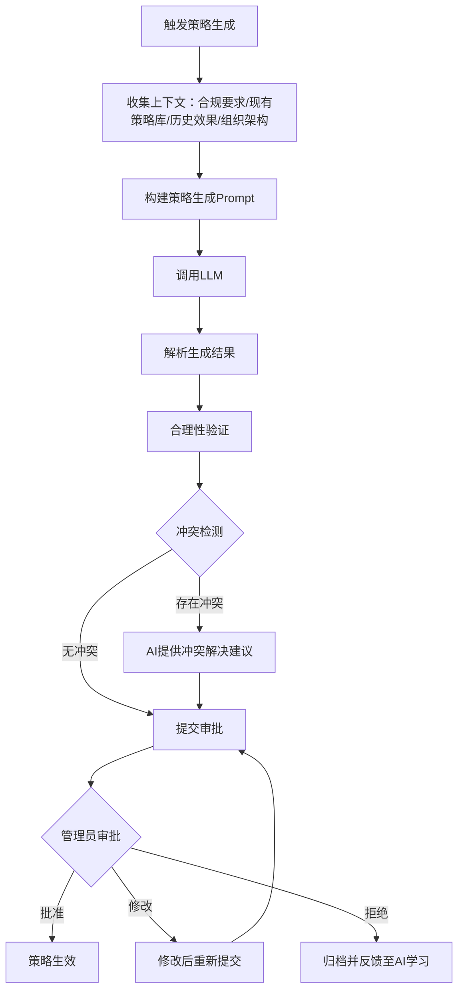

#### 4.7.4 策略数据结构

| 字段 | 类型 | 说明 |
|------|------|------|
| `policy_id` | string (UUID) | 策略唯一标识 |
| `name` | string | 策略名称 |
| `description` | string | 策略描述（含生成理由） |
| `version` | integer | 版本号 |
| `status` | enum | 状态：draft/pending_review/active/disabled/archived |
| `priority` | integer (1-100) | 优先级 |
| `source` | enum | 来源：ai_generated/manual/ai_optimized |
| `compliance_framework` | string | 关联合规框架 |
| `conditions` | object | 匹配条件（支持AND/OR组合） |
| `actions` | list[object] | 命中后执行的动作列表 |
| `scope` | object | 适用范围（部门/角色/探针类型） |
| `effective_time` | object | 生效时间范围 |
| `metrics` | object | 运行效果指标（命中次数、误报率） |

**策略条件示例：**
```json
{
  "match_type": "all",
  "rules": [
    { "field": "classification.labels", "operator": "contains", "value": "source_code" },
    { "field": "event.action", "operator": "in", "value": ["email_send", "cloud_upload"] },
    { "field": "semantic.risk_level", "operator": "gte", "value": "medium" }
  ]
}
```

**策略动作示例：**
```json
{
  "actions": [
    { "type": "block", "params": { "message": "检测到源代码外发行为，已阻断" } },
    { "type": "alert", "params": { "level": "high", "notify": ["security_team"] } },
    { "type": "log", "params": { "detail_level": "full" } }
  ]
}
```

#### 4.7.5 支持的合规框架

| 合规框架 | 策略生成重点 |
|---------|-------------|
| **等保2.0（三级）** | 数据分级分类、敏感数据外发控制、数据库访问审计 |
| **GDPR** | 个人数据识别保护、数据跨境传输控制、数据泄漏通知 |
| **网络安全法** | 个人信息保护、重要数据保护、数据出境安全 |
| **数据安全法** | 数据分级分类管理、重要数据目录管理 |
| **HIPAA** | 医疗健康信息保护、最小必要原则 |
| **PCI DSS** | 支付卡数据保护、加密传输要求 |
| **自定义框架** | 企业自定义数据安全策略要求 |

#### 4.7.6 降级方案

| 降级条件 | 降级策略 |
|---------|---------|
| LLM不可用 | 提供预置策略模板库供人工选择配置 |
| 合规框架解析失败 | 提示管理员手动拆解合规要求 |
| 策略冲突无法自动解决 | 标记冲突详情提交管理员裁决 |

---

### 4.8 自适应学习闭环

#### 4.8.1 功能概述

收集AI研判结果与人工最终处置的对比数据，持续分析误报/漏报模式，自动优化AI模型的准确率。这是系统"越用越准"的核心机制。

#### 4.8.2 学习闭环数据流

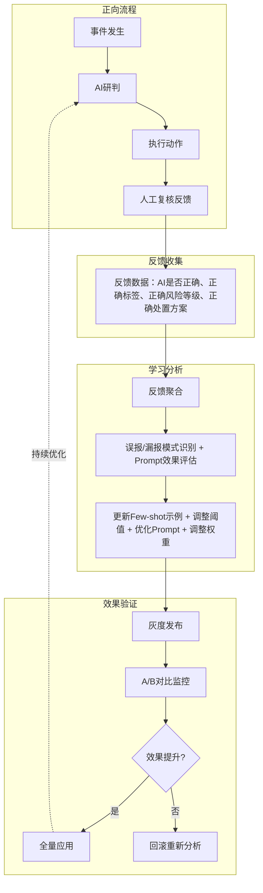

#### 4.8.3 反馈数据结构

| 字段 | 类型 | 说明 |
|------|------|------|
| `feedback_id` | string (UUID) | 反馈记录唯一标识 |
| `event_id` | string | 关联事件ID |
| `ai_result` | object | AI原始研判结果 |
| `human_judgment` | object | 人工最终判断 |
| `is_ai_correct` | boolean | AI判断是否正确 |
| `correction_type` | enum | 修正类型：false_positive/false_negative/severity_adjustment/label_correction |
| `correction_detail` | string | 修正详情 |
| `feedback_by` | string | 反馈人员ID |
| `feedback_at` | datetime | 反馈时间 |

#### 4.8.4 学习优化策略

| 优化手段 | 触发条件 | 优化内容 | 生效方式 |
|---------|---------|---------|---------|
| Few-shot示例更新 | ≥50条同类型反馈 | 提取高质量案例替换旧示例 | 自动更新Prompt |
| 分类阈值调整 | 某分类误报率>20% | 提高该分类置信度阈值 | 自动生效 |
| 评分权重调整 | 某因子与结果偏差持续增大 | 调整多因子权重 | 灰度验证后生效 |
| Prompt模板优化 | 整体准确率下降 | LLM分析反馈建议Prompt修改 | 管理员审批后生效 |
| 规则引擎补充 | LLM在简单模式上频繁误判 | 为该模式添加确定性规则 | 自动生效 |

#### 4.8.5 效果评估指标

| 指标 | 计算方式 | 目标值 |
|------|---------|-------|
| 分类准确率 | 正确分类数/总分类数 | ≥90%（3个月后） |
| 研判准确率 | 人工确认正确的研判数/总研判数 | ≥85%（3个月后） |
| 误报率 | 误报事件数/总告警数 | ≤15% |
| 漏报率 | 未检出的真实泄漏/实际泄漏总数 | ≤5% |
| 人工介入率 | 需人工复核的事件数/总事件数 | ≤10% |
| 学习收敛速度 | 达到目标准确率所需反馈轮次 | ≤500条反馈 |

#### 4.8.6 安全机制

| 风险 | 防护措施 |
|------|---------|
| 恶意反馈投毒 | 反馈需权限校验，仅Analyst以上可提交；异常反馈模式检测 |
| 学习偏差 | 灰度发布对比A/B组效果，偏差超限自动回滚 |
| 过拟合 | Few-shot示例定期轮换保持多样性；阈值调整设置上下限 |

---

### 4.9 策略兜底校验与动作执行

#### 4.9.1 功能概述

策略兜底校验模块（PolicyGuardrail）是AI研判之后的安全兜底层。在策略感知研判架构中，策略已通过"策略预匹配"（PolicyPreMatcher）注入AI研判上下文，AI研判时已充分考虑策略要求。本模块的职责是**验证AI研判结果是否违反任何显式策略规则**，并在AI降级/遗漏时补充策略强制动作。动作执行器负责根据最终动作列表执行阻断、告警、脱敏、放行等操作。

> **设计原则**：策略预匹配（研判前） + 策略兜底校验（研判后） = 双保险机制，既让AI充分理解策略意图，又确保最终动作不违反硬性策略规则。

#### 4.9.2 策略兜底校验流程

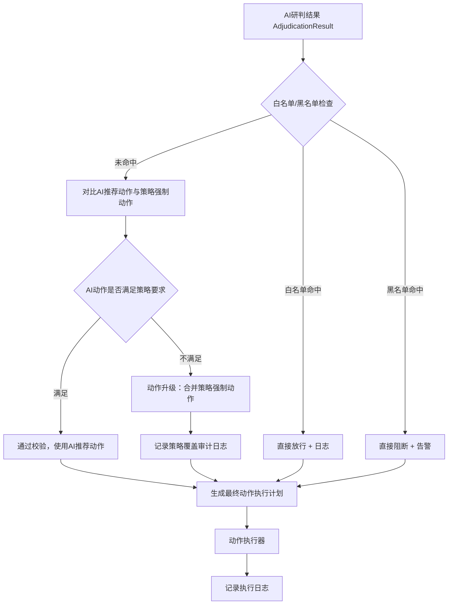

| 校验类型 | 说明 | 处理方式 |
|---------|------|---------|
| 白名单绝对放行 | 管理员预设白名单 | 直接放行，不受AI研判影响 |
| 黑名单绝对阻断 | 管理员预设黑名单 | 直接阻断 + 最高级告警 |
| 策略强制动作补充 | 策略要求的动作未出现在AI推荐中 | 将策略强制动作插入最终动作列表 |
| 动作严格度升级 | 策略要求更严格的动作（如策略要求BLOCK但AI推荐ALERT） | 升级至策略要求级别 |

#### 4.9.3 动作类型规格

| 动作类型 | 说明 | 执行方式 | 可逆性 |
|---------|------|---------|--------|
| **阻断 (BLOCK)** | 阻止数据传输 | 向探针下发阻断指令；不支持实时阻断时标记"事后阻断" | 管理员可手动放行 |
| **告警 (ALERT)** | 生成告警通知 | 系统内告警 + 邮件/企业微信/Webhook | - |
| **脱敏 (MASK)** | 脱敏后放行 | 替换敏感字段为*号；需探针支持内容修改 | 不可逆 |
| **放行 (ALLOW)** | 允许操作，仅记录 | 记录完整事件日志 | - |
| **通知 (NOTIFY)** | 通知用户本人 | 向操作用户发送安全提醒 | - |
| **隔离 (QUARANTINE)** | 暂时隔离待审核 | 文件/数据移至隔离区，人工审核后决定 | 人工审核后可释放 |

#### 4.9.4 策略冲突裁决规则

1. **优先级最高者生效**：priority值最高的策略优先
2. **同优先级：严格者优先**：BLOCK > QUARANTINE > MASK > ALERT > ALLOW
3. **同优先级同动作：最新版本生效**
4. **白名单绝对优先**：管理员白名单规则直接放行

#### 4.9.5 策略版本管理与审批流转

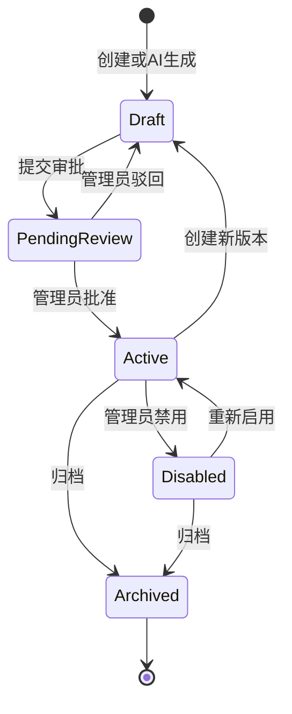

**版本管理规则：**
- 每次修改创建新版本，旧版本保留可追溯
- 支持一键回滚到任意历史版本
- 变更记录完整审计日志
- AI优化建议同样需走审批流程

---

### 4.10 管理与可视化平台

#### 4.10.1 功能概述

为安全团队提供统一管理界面，包含以下核心模块：

#### 4.10.2 事件中心

| 功能 | 说明 |
|------|------|
| 事件列表 | 按时间倒序展示所有DLP事件，支持多维度筛选（严重等级/探针类型/时间范围/用户/处置状态） |
| 事件详情 | 完整信息：基本信息、AI分类结果、语义分析结果、意图识别结果、研判结论、处置记录 |
| AI研判审核 | 分析师确认/修正AI研判结果，提供"同意"/"修改"/"标记误报"操作 |
| 反馈提交 | 分析师提交对AI研判结果的反馈，进入自适应学习闭环 |
| 事件统计 | 按时间/类型/严重等级/探针的事件分布统计图表 |
| 批量操作 | 批量确认、批量放行、批量导出 |
| 事件导出 | 导出事件明细为CSV/PDF格式 |

#### 4.10.3 策略管理

| 功能 | 说明 |
|------|------|
| 策略列表 | 展示所有策略，支持按状态/类型/来源/合规框架筛选 |
| 策略编辑 | 可视化策略编辑器，条件组合+动作配置 |
| AI策略生成 | 输入合规要求或自然语言描述，AI生成策略草稿 |
| 策略审批 | 审批队列，展示待审批策略详情、生成理由、冲突分析 |
| 策略效果 | 每条策略的运行统计（命中次数、误报率、最近命中时间） |
| 版本管理 | 版本历史、版本对比、一键回滚 |
| 策略模拟 | 输入样本事件模拟匹配结果（不实际执行） |

#### 4.10.4 数据地图

| 功能 | 说明 |
|------|------|
| 敏感数据分布 | 可视化展示企业内敏感数据分布（按部门/系统/数据类型） |
| 数据流向图 | 展示敏感数据流向路径 |
| 风险热点 | 标注高风险的数据存储位置和传输路径 |
| 数据分级统计 | 按数据分级的数量和占比统计 |

#### 4.10.5 审计日志

| 功能 | 说明 |
|------|------|
| 操作日志 | 记录所有用户在管理平台的操作 |
| AI决策日志 | 记录AI每次研判的完整输入、输出和推理过程 |
| 系统日志 | 系统运行状态日志 |
| 日志检索 | 全文检索 + 结构化筛选 |
| 合规报告 | 按合规框架生成审计报告（等保/GDPR审计报告模板） |

#### 4.10.6 模型监控

| 功能 | 说明 |
|------|------|
| 准确率趋势 | 分类准确率、研判准确率时间趋势图 |
| 误报率监控 | 整体误报率和分类别误报率趋势 |
| 人工介入率 | 需人工介入的事件占比趋势 |
| LLM调用统计 | 调用次数、平均延迟、Token消耗、费用统计 |
| 缓存效率 | 缓存命中率趋势、缓存大小 |
| 学习效果 | 自适应学习每轮优化的效果对比 |
| 模型健康度 | LLM服务可用性、降级次数、错误率 |

#### 4.10.7 探针管理

| 功能 | 说明 |
|------|------|
| 探针注册 | 新探针注册接入，配置探针类型和数据格式 |
| 探针列表 | 展示所有已注册探针状态（在线/离线/异常） |
| 心跳监控 | 探针心跳状态监控，离线自动告警 |
| 数据量统计 | 各探针数据上报量统计和趋势 |

#### 4.10.8 系统配置

| 功能 | 说明 |
|------|------|
| LLM配置 | 配置LLM模型后端（API Key、模型选择、调用参数） |
| 阈值配置 | 配置各类AI分析的置信度阈值、风险评分阈值 |
| 通知配置 | 配置告警通知渠道（邮件/企业微信/Webhook） |
| 用户管理 | 用户/角色/权限管理 |
| 运行模式 | 切换系统运行模式（全自动/人机协同/纯监控） |

---

## 5. 非功能需求

### 5.1 性能需求

| 指标 | 要求 | 说明 |
|------|------|------|
| 事件采集吞吐量 | ≥10,000 events/s | 所有探针数据总吞吐 |
| 归一化处理延迟 | ≤50ms/event | 从Kafka消费到DLPEvent输出 |
| 特征提取延迟 | ≤500ms/event | 含文本/行为/结构/统计特征提取 |
| 上下文富化延迟 | ≤1s/event | 含外部系统查询 |
| AI分析延迟（缓存命中） | ≤10ms | 相同内容直接返回缓存 |
| AI分析延迟（LLM调用） | ≤5s | 含分类+语义+意图三模块并行 |
| AI研判延迟 | ≤3s | 综合多维度最终研判 |
| 端到端延迟（P95） | ≤10s | 从探针上报到动作执行 |
| 端到端延迟（P99） | ≤30s | 含LLM调用的极端情况 |
| AI分析吞吐量 | ≥500 events/s | 通过并行+缓存+异步实现 |
| 缓存命中率 | ≥60% | 相似内容去重 |
| Dashboard查询响应 | ≤2s | 统计查询和报表加载 |

### 5.2 可用性需求

| 指标 | 要求 | 说明 |
|------|------|------|
| 系统可用性 | ≥99.9% | 年停机≤8.76小时 |
| AI引擎可用性 | ≥99.5% | LLM服务可用性（含降级） |
| 数据采集连续性 | 0数据丢失 | Kafka持久化 + at-least-once |
| 故障恢复时间(RTO) | ≤30分钟 | 从故障到服务恢复 |
| 数据恢复点(RPO) | ≤5分钟 | 最大可接受数据丢失窗口 |
| 降级服务能力 | LLM不可用时不影响基础检测 | 规则引擎兜底 |

### 5.3 安全需求

| 需求 | 详细说明 |
|------|---------|
| **数据脱敏** | 敏感数据传入LLM前必须脱敏（真实值替换为占位符），分析后还原 |
| **传输加密** | 所有API通信HTTPS/TLS 1.2+；Kafka通信启用SSL |
| **存储加密** | 数据库敏感字段加密存储；Redis启用密码认证 |
| **认证鉴权** | JWT Token认证 + RBAC权限控制；Token有效期≤24h |
| **审计追踪** | 所有操作记录完整审计日志，不可篡改；AI决策日志含完整推理过程 |
| **API安全** | 限流（默认100 req/s/user）；参数校验；SQL注入/XSS防护 |
| **LLM安全** | API Key加密存储；调用日志脱敏；防Prompt注入攻击 |
| **数据隔离** | 多租户场景下数据严格隔离 |

### 5.4 可扩展性需求

| 需求 | 详细说明 |
|------|---------|
| 水平扩展 | Kafka消费者、AI分析Worker、API服务均支持水平扩展 |
| 多模型支持 | LLM Provider抽象层支持切换不同模型后端 |
| 探针扩展 | 新增探针类型只需实现适配器，无需修改核心流程 |
| 策略扩展 | 支持自定义策略条件和动作类型 |
| 合规框架扩展 | 支持导入新的合规框架定义 |

### 5.5 可观测性需求

| 需求 | 详细说明 |
|------|---------|
| 结构化日志 | 全链路JSON格式日志，包含trace_id串联 |
| 指标暴露 | Prometheus格式指标，覆盖业务和技术指标 |
| 链路追踪 | 分布式链路追踪，trace_id贯穿全链路 |
| 健康检查 | 标准健康检查端点（/health、/ready） |
| 告警规则 | 预置关键指标告警规则（延迟、错误率、队列堆积） |

---

## 6. 数据架构设计

### 6.1 核心数据实体关系

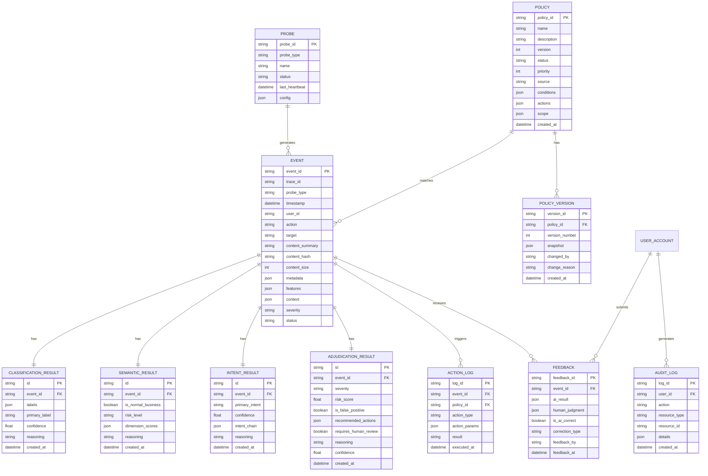

### 6.2 数据存储策略

| 数据类型 | 存储介质 | 保留策略 | 说明 |
|---------|---------|---------|------|
| 事件数据 | PostgreSQL | 热数据90天，冷数据归档至对象存储 | 主要查询和分析对象 |
| AI分析结果 | PostgreSQL | 与事件数据同步 | 关联事件，支持审计 |
| 策略数据 | PostgreSQL | 永久保留 | 含全版本历史 |
| 审计日志 | PostgreSQL | 永久保留（合规要求） | 不可篡改 |
| 反馈数据 | PostgreSQL | 永久保留 | 自适应学习素材 |
| AI分类缓存 | Redis | TTL 24小时 | 基于content_hash |
| 策略缓存 | Redis | TTL 1小时，策略变更时主动失效 | 加速策略预匹配和兜底校验 |
| 原始数据 | 对象存储(S3/COS) | 按合规要求保留（通常180天） | 溯源用途 |
| Kafka消息 | Kafka | 保留7天 | 消费失败可回溯重放 |

---

## 7. 部署架构

### 7.1 部署拓扑

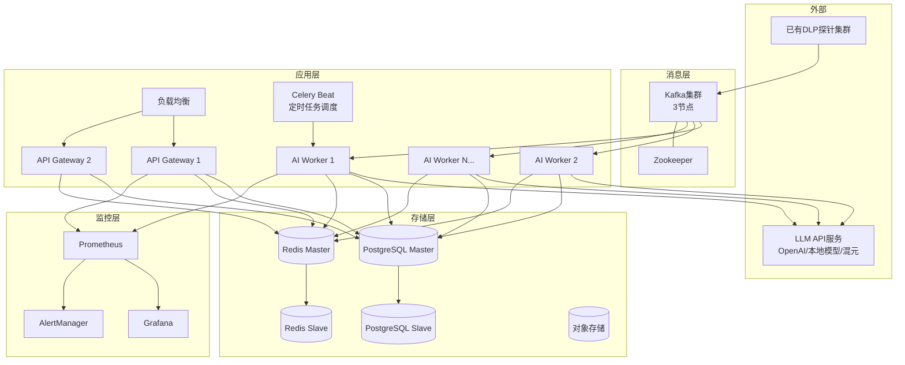

### 7.2 部署规格建议

| 组件 | 最小规格 | 推荐生产规格 | 数量 |
|------|---------|-------------|------|
| API Gateway | 2C4G | 4C8G | 2+ (负载均衡) |
| AI Worker | 4C8G | 8C16G | 3+ (按吞吐量扩展) |
| Celery Beat | 1C2G | 2C4G | 1 (单点+监控) |
| PostgreSQL | 4C8G | 8C32G | 2 (主从) |
| Redis | 2C4G | 4C8G | 2 (主从) |
| Kafka | 4C8G | 8C16G | 3 (集群) |
| Prometheus+Grafana | 2C4G | 4C8G | 1 |

### 7.3 环境规划

| 环境 | 用途 | LLM后端 | 数据 |
|------|------|---------|------|
| 开发环境 (DEV) | 功能开发和联调 | Mock LLM | 模拟数据 |
| 测试环境 (TEST) | 集成测试和性能测试 | 轻量级模型 | 脱敏生产数据 |
| 预发环境 (STAGING) | 上线前验证 | 生产级LLM | 影子流量 |
| 生产环境 (PROD) | 正式运行 | 生产级LLM | 真实数据 |

---

## 8. API网关设计

### 8.1 API总览

| API分组 | 路径前缀 | 说明 | 主要使用者 |
|---------|---------|------|-----------|
| 事件API | `/api/v1/events` | 事件查询、处置、反馈 | Analyst、Admin |
| 策略API | `/api/v1/policies` | 策略CRUD、审批、AI生成 | Admin |
| 探针API | `/api/v1/probes` | 探针注册、心跳、状态 | Operator、探针 |
| Dashboard API | `/api/v1/dashboard` | 统计指标、趋势数据 | All |
| 审计API | `/api/v1/audit` | 审计日志查询、合规报告 | Compliance、Admin |
| 模型API | `/api/v1/models` | 模型监控、配置、学习管理 | Admin |
| 认证API | `/api/v1/auth` | 登录、Token刷新、用户管理 | All |
| 系统API | `/api/v1/system` | 配置管理、健康检查 | Admin、Operator |

### 8.2 核心API端点

**事件API：**
| 方法 | 路径 | 说明 |
|------|------|------|
| GET | `/events` | 查询事件列表（分页、筛选） |
| GET | `/events/{id}` | 获取事件详情（含AI分析结果全链路） |
| POST | `/events/{id}/feedback` | 提交人工反馈 |
| POST | `/events/{id}/action` | 手动执行处置动作 |
| POST | `/events/batch-action` | 批量处置 |
| GET | `/events/statistics` | 事件统计数据 |
| GET | `/events/export` | 导出事件（CSV/PDF） |

**策略API：**
| 方法 | 路径 | 说明 |
|------|------|------|
| GET | `/policies` | 查询策略列表 |
| POST | `/policies` | 创建策略 |
| PUT | `/policies/{id}` | 更新策略 |
| DELETE | `/policies/{id}` | 删除/归档策略 |
| POST | `/policies/generate` | AI生成策略（输入合规要求或自然语言） |
| POST | `/policies/{id}/approve` | 审批策略 |
| POST | `/policies/{id}/rollback` | 回滚到指定版本 |
| POST | `/policies/{id}/simulate` | 模拟策略兜底校验 |
| GET | `/policies/{id}/versions` | 获取版本历史 |
| GET | `/policies/{id}/metrics` | 获取策略效果指标 |

**探针API：**
| 方法 | 路径 | 说明 |
|------|------|------|
| POST | `/probes/register` | 探针注册 |
| POST | `/probes/{id}/heartbeat` | 探针心跳上报 |
| GET | `/probes` | 查询探针列表 |
| GET | `/probes/{id}` | 获取探针详情 |
| DELETE | `/probes/{id}` | 注销探针 |

**Dashboard API：**
| 方法 | 路径 | 说明 |
|------|------|------|
| GET | `/dashboard/overview` | 全局统计概览 |
| GET | `/dashboard/trends` | 趋势数据（时间序列） |
| GET | `/dashboard/data-map` | 数据地图概览 |
| GET | `/dashboard/model-metrics` | 模型效果指标 |

### 8.3 通用规范

- **认证**：除 `/auth/login` 和 `/probes/heartbeat` 外，所有API均需JWT Bearer Token
- **分页**：列表查询支持 `page`、`page_size`（默认20，最大100）
- **筛选**：通过Query参数传递筛选条件
- **排序**：`sort_by` + `sort_order`（asc/desc）
- **响应格式**：统一JSON格式，包含 `code`、`message`、`data` 三个顶层字段
- **错误码**：4xx客户端错误、5xx服务端错误，附带业务错误码和描述
- **限流**：默认100 req/s/user，探针心跳不限流
- **版本管理**：URL路径中嵌入版本号 `/api/v1/`

---

## 9. 附录

### 9.1 术语表

| 术语 | 说明 |
|------|------|
| DLP | Data Loss Prevention，数据防泄漏 |
| LLM | Large Language Model，大语言模型 |
| PII | Personally Identifiable Information，个人身份信息 |
| RBAC | Role-Based Access Control，基于角色的访问控制 |
| Few-shot | 少样本学习，通过提供少量示例引导LLM输出 |
| Prompt | 提示词，输入给LLM的指令和上下文 |
| DLQ | Dead Letter Queue，死信队列 |
| RTO | Recovery Time Objective，恢复时间目标 |
| RPO | Recovery Point Objective，恢复点目标 |

### 9.2 合规参考标准

| 标准 | 全称 | 适用范围 |
|------|------|---------|
| 等保2.0 | 信息安全等级保护2.0 | 中国境内所有信息系统 |
| GDPR | General Data Protection Regulation | 涉及欧盟公民数据的组织 |
| 网络安全法 | 中华人民共和国网络安全法 | 中国境内网络运营者 |
| 数据安全法 | 中华人民共和国数据安全法 | 中国境内数据处理活动 |
| HIPAA | Health Insurance Portability and Accountability Act | 美国医疗健康信息 |
| PCI DSS | Payment Card Industry Data Security Standard | 涉及支付卡数据的组织 |

### 9.3 系统运行模式说明

| 模式 | AI行为 | 动作执行 | 适用阶段 |
|------|--------|---------|---------|
| **纯监控模式** | AI分析并记录，不触发动作 | 仅记录日志 | 系统上线初期，验证AI判断准确性 |
| **人机协同模式** | AI分析并给出建议，人工确认后执行 | 人工审批后执行 | 系统稳定期，AI准确率达标前 |
| **全自动模式** | AI分析并自动执行（高置信度），低置信度仍送人工 | 自动执行 | AI准确率达标后 |

### 9.4 里程碑规划

| 阶段 | 时间 | 交付物 | 核心目标 |
|------|------|--------|---------|
| M1：基础搭建 | 第1-4周 | 数据管道 + 探针对接 + 基础AI分类 | 打通数据流，验证AI分类可行性 |
| M2：AI引擎完整 | 第5-8周 | 语义分析 + 意图识别 + 事件研判 + 策略引擎 | AI分析全链路贯通 |
| M3：管理平台 | 第9-12周 | 管理Dashboard + API + 策略管理 | 系统可用，纯监控模式上线 |
| M4：闭环优化 | 第13-16周 | 自适应学习 + 策略生成 + 反馈闭环 | 人机协同模式上线 |
| M5：稳定运营 | 第17-24周 | 持续优化 + 性能调优 + 准确率提升 | 全自动模式切换评估 |

### 9.5 风险与缓解

| 风险 | 影响 | 缓解措施 |
|------|------|---------|
| LLM API不稳定/延迟高 | AI分析能力受限 | 多模型后端切换 + 规则引擎降级 + 结果缓存 |
| LLM调用成本过高 | 运营成本压力 | 缓存命中率优化（>60%）+ 规则预筛减少LLM调用 + 本地小模型分流 |
| 敏感数据泄漏给LLM | 合规风险 | 严格脱敏预处理 + 本地部署模型备选 + 脱敏效果审计 |
| AI准确率不达预期 | 用户信任度下降 | 渐进上线策略 + 人机协同模式过渡 + 持续学习优化 |
| 数据量超预期增长 | 系统性能瓶颈 | 水平扩展架构 + Kafka分区扩容 + 冷热数据分离 |
| Prompt注入攻击 | AI判断被操纵 | 输入清洗 + 输出格式校验 + 异常检测 |
